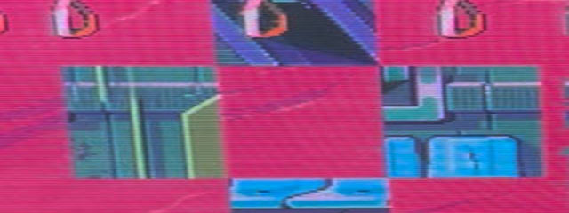

# mega-ppm

## About

*mega-ppm* is a cutom mapper for Mega-Everdrive PRO.

## Repository Structure

- **fpga**  
  fpga core

- **mcu**  
  risc-v based mcu core (stm32 replacement)

- **tools**  
  everdrive usb tool, bin to verilog converter etc.

## Building notes

MCU code can be linked directly to fpga using internal ram, or loaded to the cartridge sram. look at mcu/usb.bat and mcu_core.sv
